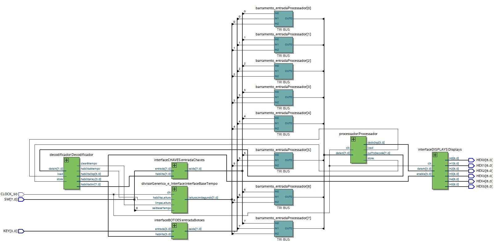

# Projeto 1 - Design de Computadores
### Alunos: Matheus Pellizzon, Pedro Teófilo Ramos e Pedro Paulo Telho
 

### Diagrama da arquitetura 

  

### Configurações dos componentes

##### Switches
<ul>
  <li>SW 0: seletor da base de tempo.</li>
  <li>SW 1: Se 0 = usa o modelo hh:mm:ss; Se 1 = usa o modelo hh:mm A/P;</li>
  <li>SW 2: controla a configuração do relógio;</li>
  <li>SW 3: ativa configuração do temporizador;</li>
  <li>SW 4: Se 1 = inicia contagem regressiva do temporizador; Se 0 = para o temporizador;</li>
</ul>

##### Botões

Quando <b>SW 2</b> está ativada:

<ul>
  <li>Key 0: incrementa unidade de minuto;</li>
  <li>Key 1: incrementa dezena de minuto;</li>
  <li>Key 2: incrementa hora.</li>
</ul>
 

Quando <b>SW 3</b> está ativada:

<ul>
  <li>Key 0: incrementa segundos;</li>
  <li>Key 1: incrementa minutos;</li>
  <li>Key 2: incrementa horas;</li>
  <li>Key 3: zera o temporizador;</li>
</ul>
 

### Requisitos do projeto
##### Obrigatórios
- [x] indica horas, minutos e segundos
- [x] possui sistema para acertar horário
- [x] possui seleção para base de tempo

##### Opcionais
###### sobem meio conceito (+)
- [x] indicação do horário com base em 12 horas - AM/PM
- [ ] sistema de despertador
- [x] temporizador com contagem regressiva

###### sobem um conceito
- [x] assembler em Python
- [ ] pilha controlada por hardware
- [ ] instrução de chamada de sub-rotina com um nível 

Demais arquivos, incluindo código em assembly (relogio.s) e assembler podem ser encontrados no github: https://github.com/pedrotramos/Projeto1-DesignComp.
